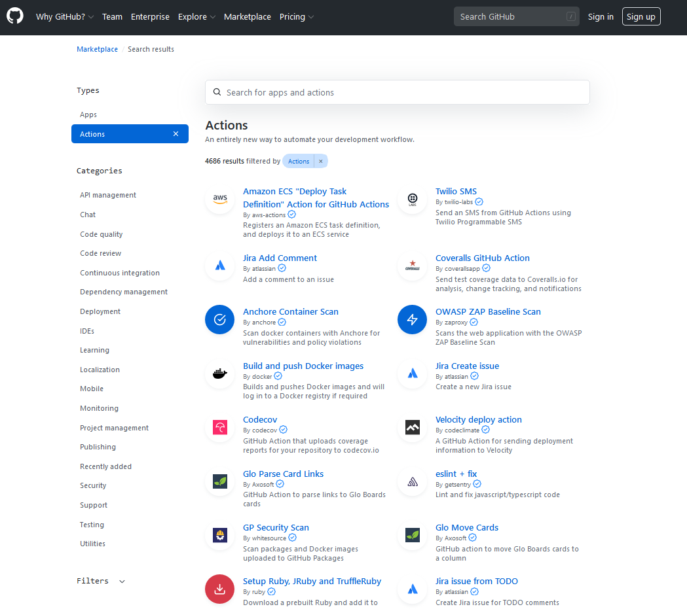

<!-- .element: title="GitHub Actions & Python" -->

# GitHub Actions & Python

PyconAU 2020 - Jack McKew

* What are GitHub Actions?
* Why use them?
* How to set them up?

Note: Rough overview on what is covered in the talk, mention we'll go through a real world example

---

## Quick Note

This talk is open source & built with GitHub Actions at: <https://github.com/JackMcKew/pyconau-2020-github-actions-and-python>

Note: Mention that the presentation is live on the web and hosted on github pages

---

## Who am I

I'm Jack McKew, I'm a Snr software engineer at [Deckee](deckee.com/)

I absolutely love solving problems, especially with Python! 🐍

I write a weekly blog on software, technology and more over at [jackmckew.dev](https://jackmckew.dev/).

You can reach me on:

* Twitter: [@jac_mcq](https://twitter.com/jac_mcq)
* LinkedIn: [jack-mckew](https://www.linkedin.com/in/jack-mckew/)
* GitHub: [@JackMcKew](https://github.com/JackMcKew)

Note: Reiterate that the talk is completely open source and links are all live

---

## Projects I work on

I'm the creator & maintainer of open source packages such as:

* [Pandas_Alive](https://github.com/JackMcKew/pandas_alive).
* [awesome-python-bytes](https://github.com/JackMcKew/awesome-python-bytes).
* Numerous GitHub Actions:
    * [pyinstaller-action-windows](https://github.com/JackMcKew/pyinstaller-action-windows)
    * [pyinstaller-action-linux](https://github.com/JackMcKew/pyinstaller-action-linux)
    * [python-interrogate-check](https://github.com/JackMcKew/python-interrogate-check)

Note: Mention github actions are used in all of these projects and more. Pandas alive almost has 20k downloads off PyPI. Show pandas_alive readme page after slide.

---

## The Workflow


---

## What are GitHub Actions

GitHub Actions are free-to-use, plug & play blocks of continuous integration / continuous delivery (CI/CD). Unlimited run time for public repositories and paid for private.

> CI/CD allows us to automate building, testing and deployment of applications.

---

## But what is CI/CD?

CI = Automated Build, Package, Test

CD = Automated Delivery

Note: We want to run these things every time we push to our Github Repo

---

## GitHub Action Marketplace

Find pre-made blocks of CI/CD to plug & play!

> <https://github.com/marketplace?type=actions>

Note: These are thousands of pre-made actions ready to use

---



---

## Why should you use them

If you can automate something, you definitely should.

<iframe src='https://gfycat.com/ifr/AchingOptimisticAlabamamapturtle' frameborder='0' scrolling='no' width=100% height='500'></iframe><p> <a href="https://gfycat.com/achingoptimisticalabamamapturtle">via Gfycat</a></p>

---

### What I use GitHub Actions for

This talk!!

And also...

* Testing!
* Building/managing documentation
* Syncing examples with working code
* Checking all external links are valid in documentation
* Checking docstring coverage (with [interrogate](https://pypi.org/project/interrogate/))
* Packaging Python code as an executable

---

## But how do I set them up

All's needed is a `my-action.yml` file in `.github/workflows`

---

``` yaml
name: Build & Publish Presentation with reveal-md

on: push
```
<!-- .element: class="fragment" data-fragment-index="1" -->

``` yaml
jobs:
  release:
    name: Build & Publish
    runs-on: ubuntu-latest
    steps:
      - uses: actions/checkout@v1
```
<!-- .element: class="fragment" data-fragment-index="2" -->

``` yaml
      - name: Install dependencies & Build Presentation
        run: |
          sudo npm install -g reveal-md --unsafe-perm
          sudo reveal-md Presentation.md --static _site --highlight-theme github
```
<!-- .element: class="fragment" data-fragment-index="3" -->

``` yaml
      - name: Deploy 🚀
        uses: JamesIves/github-pages-deploy-action@releases/v3
        with:
          ACCESS_TOKEN: ${{ secrets.ACCESS_TOKEN }}
          BRANCH: gh-pages # The branch the action should deploy to.
          FOLDER: _site # The folder the action should deploy.
```
<!-- .element: class="fragment" data-fragment-index="4" -->

---

``` yaml
name: Build & Publish Presentation with reveal-md

on: push

jobs:
  release:
    name: Build & Publish
    runs-on: ubuntu-latest
    steps:
      - uses: actions/checkout@v1

      - name: Install dependencies & Build Presentation
        run: |
          sudo npm install -g reveal-md --unsafe-perm
          sudo reveal-md Presentation.md --static _site --highlight-theme github
      - name: Deploy 🚀
        uses: JamesIves/github-pages-deploy-action@releases/v3
        with:
          ACCESS_TOKEN: ${{ secrets.ACCESS_TOKEN }}
          BRANCH: gh-pages # The branch the action should deploy to.
          FOLDER: _site # The folder the action should deploy.
```


---

## GitHub Actions in Action

Show curlybois here -->

> Let's do a live demo updating this presentation! 
---

## But where's the Python? 🐍

``` yaml
    - uses: actions/checkout@v1
    - name: Set up Python 3.7
      uses: actions/setup-python@v1
      with:
        python-version: 3.7

```
<!-- .element: class="fragment" data-fragment-index="1" -->

``` yaml
    - name: Install dependencies & Convert README.ipynb
      run: |
        python -m pip install --upgrade pip
        pip install -r requirements.txt
        jupyter nbconvert --to markdown README.ipynb
```
<!-- .element: class="fragment" data-fragment-index="2" -->

---

## Can I make my own actions?

Yes!

---

## How?

Currently GitHub actions are built either using:

* Docker
* Javascript

---

## Let's Dive into Actions on Projects I maintain

---

## That's all folks

Feel free to reach out to me on:

* My Blog: [jackmckew.dev](https://jackmckew.dev/)
* Twitter: [@jac_mcq](https://twitter.com/jac_mcq)
* LinkedIn: [jack-mckew](https://www.linkedin.com/in/jack-mckew/)
* GitHub: [@JackMcKew](https://github.com/JackMcKew)
